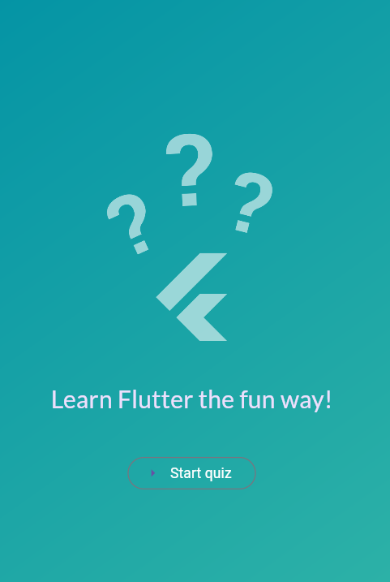
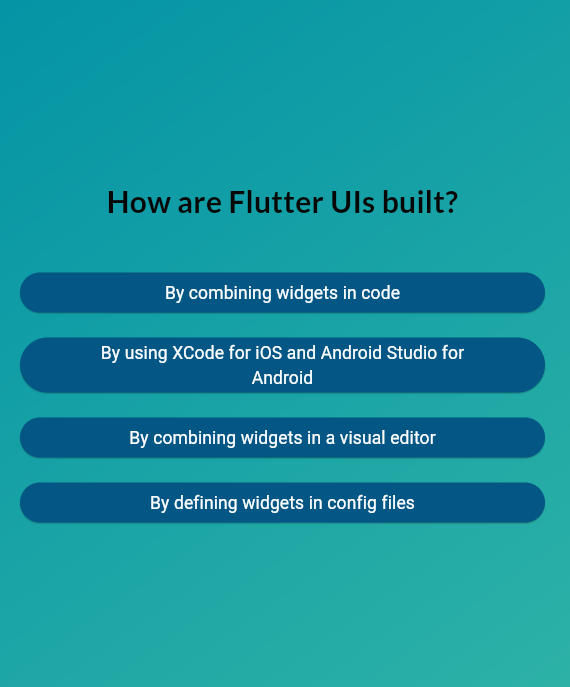
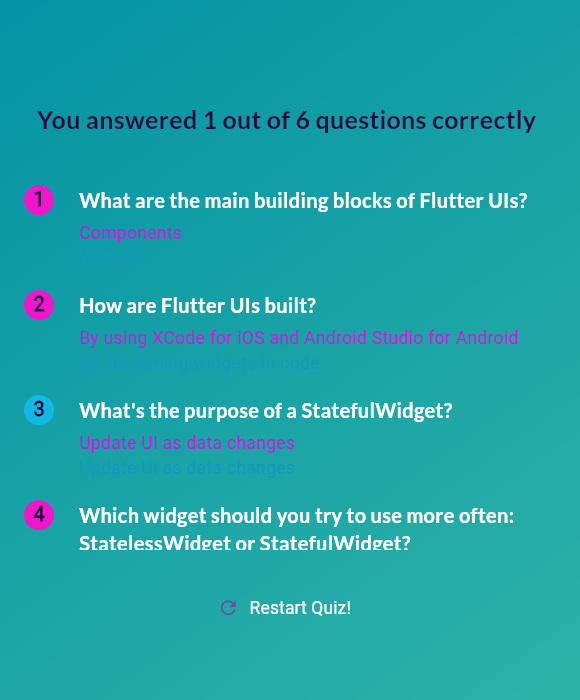

#  Flutter Quiz Game

A fun and interactive quiz app built with **Flutter** and **Dart**.  
Test your Flutter knowledge with multiple-choice questions, view your results, and restart to improve your score!

## Features

✅ Beautiful gradient UI with Google Fonts  
✅ Multiple-choice quiz questions  
✅ Score summary with correct/incorrect answer indicators  
✅ Restart option to play again  
✅ Smooth transitions between screens  
✅ Fully responsive on Android, iOS, and web

## Screens Overview

**Start Screen** - Displays logo and “Start Quiz” button
**Questions Screen** - Shows questions with multiple-choice answers
**Results Screen** - Displays score summary and “Restart” button

## Folder Structure

.lib/
├── data/
│ └── questions.dart # Quiz questions data
├── models/
│ └── quiz_questions.dart # QuizQuestion model
├── questions_summary/
│ ├── questions_summary.dart # Scrollable summary list
│ ├── question_identifier.dart # Circle with question number & correctness color
│ └── summary_item.dart # Summary item layout
├── answer_button.dart # Custom answer button widget
├── questions_screen.dart # Main questions screen
├── results_screen.dart # Results and score screen
├── start_screen.dart # Starting screen with logo
└── quiz.dart # Root widget controlling app state

## Getting Started

This project is a starting point for a Flutter application.

A few resources to get you started if this is your first Flutter project:

- [Lab: Write your first Flutter app](https://docs.flutter.dev/get-started/codelab)
- [Cookbook: Useful Flutter samples](https://docs.flutter.dev/cookbook)

For help getting started with Flutter development, view the
[online documentation](https://docs.flutter.dev/), which offers tutorials,
samples, guidance on mobile development, and a full API reference.

## Screenshots

### Start Screen

### Questions Screen

### Results Screen
